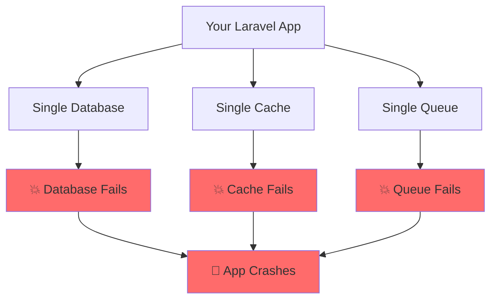
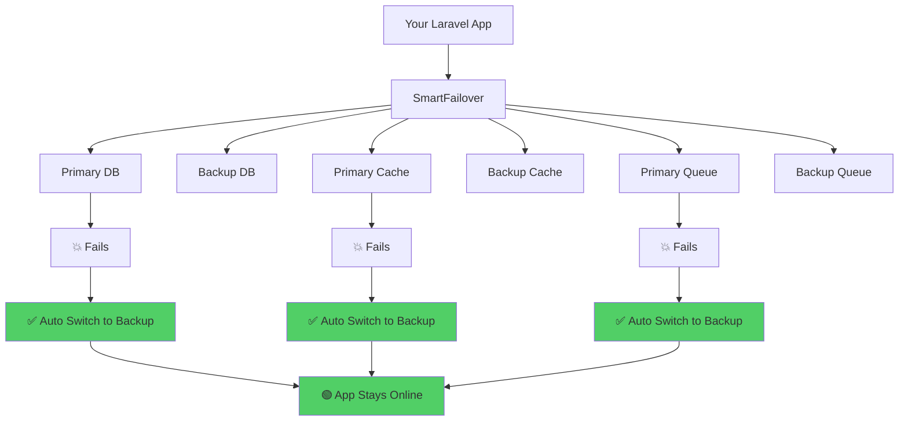

# 🚀 Laravel SmartFailover

<div align="center">


**The Ultimate Laravel Package for Bulletproof Service Failover**

*Never let a service failure bring down your application again*

[](https://php.net)
[](https://laravel.com)
[](https://packagist.org/packages/mirzaaghazadeh/smart-failover)
[](https://opensource.org/licenses/MIT)
[](https://github.com/mirzaaghazadeh/SmartFailover/actions)

[📖 Documentation](#-table-of-contents) • [🚀 Quick Start](#-quick-start) • [💡 Examples](#-usage-examples) • [🏥 Health Monitoring](#-health-monitoring) • [🤝 Contributing](#-contributing)

</div>

---

## 📋 Table of Contents

- [🎯 Why SmartFailover?](#-why-smartfailover)
- [✨ Features](#-features)
- [🚀 Quick Start](#-quick-start)
- [⚙️ Configuration](#️-configuration)
- [💡 Usage Examples](#-usage-examples)
- [🏥 Health Monitoring](#-health-monitoring)
- [🔔 Notifications & Alerts](#-notifications--alerts)
- [📊 Dashboard Integration](#-dashboard-integration)
- [🧪 Testing](#-testing)
- [📈 Performance](#-performance)
- [🔒 Security](#-security)
- [🤝 Contributing](#-contributing)
- [📄 License](#-license)

---

## 🎯 Why SmartFailover?

<div align="center">

### The Problem 😰



### The Solution 🎉



</div>

**SmartFailover** transforms your single-point-of-failure Laravel application into a resilient, self-healing system that automatically switches to backup services when primary ones fail.

### 🎯 Key Benefits

| Before SmartFailover | After SmartFailover |
|---------------------|-------------------|
| 💥 Single database failure = App down | ✅ Automatic failover to backup database |
| 🐌 Manual intervention required | 🚀 Zero-downtime automatic switching |
| 😰 No visibility into service health | 📊 Real-time health monitoring |
| 🔥 Panic when services fail | 😌 Sleep peacefully with alerts |

---

## ✨ Features

<div align="center">

### 🛡️ **Bulletproof Service Protection**

</div>

| Service | Primary | Fallbacks | Health Checks |
|---------|---------|-----------|---------------|
| 🗄️ **Database** | MySQL, PostgreSQL | Multiple backups | ✅ Connection tests |
| 🚀 **Cache** | Redis, Memcached | Array, File | ✅ Read/Write tests |
| 📬 **Queue** | SQS, Redis | Database, Sync | ✅ Job dispatch tests |
| 📧 **Mail** | SMTP, SES | Mailgun, Log | ✅ Connection tests |
| 💾 **Storage** | S3, GCS | Local, FTP | ✅ File operations |

### 🎯 **Smart Features**

<div align="center">

| 🔄 Auto Failover | 🏥 Health Monitoring | 🔔 Smart Alerts | 🎛️ Easy Integration |
|:---------------:|:-------------------:|:---------------:|:------------------:|
| Instant switching when services fail | Real-time service health checks | Slack, Telegram, Email notifications | Minimal code changes required |
| Exponential backoff retry logic | Performance metrics tracking | Intelligent alert throttling | Fluent API design |
| Graceful degradation support | HTTP health endpoints | Custom notification channels | Laravel-native integration |

</div>

---

## 🚀 Quick Start

### 📦 Installation

```bash
# 1️⃣ Install the package
composer require mirzaaghazadeh/smart-failover

# 2️⃣ Publish configuration
php artisan vendor:publish --provider="Mirzaaghazadeh\SmartFailover\SmartFailoverServiceProvider" --tag="config"

# 3️⃣ Configure your services (optional)
php artisan vendor:publish --provider="Mirzaaghazadeh\SmartFailover\SmartFailoverServiceProvider" --tag="migrations"
```

### ⚡ 30-Second Setup

```php
// That's it! Start using SmartFailover immediately:

use Mirzaaghazadeh\SmartFailover\Facades\SmartFailover;

// Wrap your existing code with failover protection
SmartFailover::db('mysql', ['mysql_backup'])
    ->cache('redis', ['memcached'])
    ->execute(function() {
        // Your existing Laravel code works unchanged!
        $user = User::create($userData);
        Cache::put('user_' . $user->id, $user, 3600);
        return $user;
    });
```

<div align="center">

### 🎉 **That's it! Your app is now bulletproof!**

</div>

---

## ⚙️ Configuration

### 🔧 Basic Configuration

The `config/smart-failover.php` file is your control center:

```php
<?php

return [
    // 🗄️ Database Failover
    'database' => [
        'primary' => 'mysql',
        'fallbacks' => ['mysql_backup', 'sqlite_fallback'],
        'health_check_interval' => 30, // seconds
        'retry_attempts' => 3,
        'retry_delay' => 1000, // milliseconds
    ],
    
    // 🚀 Cache Failover  
    'cache' => [
        'primary' => 'redis',
        'fallbacks' => ['memcached', 'array'],
        'health_check_interval' => 15,
        'retry_attempts' => 2,
    ],
    
    // 📬 Queue Failover
    'queue' => [
        'primary' => 'sqs',
        'fallbacks' => ['redis', 'database'],
        'health_check_interval' => 60,
        'retry_attempts' => 3,
    ],
    
    // 🔔 Notifications
    'notifications' => [
        'slack' => [
            'webhook_url' => env('SMART_FAILOVER_SLACK_WEBHOOK'),
            'channel' => '#alerts',
        ],
        'telegram' => [
            'bot_token' => env('SMART_FAILOVER_TELEGRAM_BOT_TOKEN'),
            'chat_id' => env('SMART_FAILOVER_TELEGRAM_CHAT_ID'),
        ],
    ],
];
```

### 🌍 Environment Variables

Add these to your `.env` file:

```bash
# Slack Notifications
SMART_FAILOVER_SLACK_WEBHOOK=https://hooks.slack.com/services/YOUR/SLACK/WEBHOOK

# Telegram Notifications  
SMART_FAILOVER_TELEGRAM_BOT_TOKEN=your_bot_token
SMART_FAILOVER_TELEGRAM_CHAT_ID=your_chat_id

# Health Check Settings
SMART_FAILOVER_HEALTH_ENABLED=true
SMART_FAILOVER_HEALTH_CACHE_TTL=60
```

---

## 💡 Usage Examples

### 🎯 **The Magic One-Liner**

```php
use Mirzaaghazadeh\SmartFailover\Facades\SmartFailover;

// Protect ALL your services in one beautiful line
SmartFailover::db('mysql', ['mysql_backup'])
    ->cache('redis', ['memcached', 'array'])
    ->queue('sqs', ['redis', 'database'])
    ->execute(function() {
        // Your normal Laravel code - unchanged!
        $order = Order::create($orderData);
        Cache::put('order_' . $order->id, $order, 3600);
        ProcessOrderJob::dispatch($order);
        return $order;
    });
```

### 🗄️ **Database Failover Examples**

<details>
<summary><strong>🔍 Click to see Database Examples</strong></summary>

```php
// ✅ Simple Database Failover
SmartFailover::db('mysql_primary', ['mysql_backup'])
    ->execute(function() {
        return User::where('active', true)->get();
    });

// ✅ With Graceful Degradation
SmartFailover::db('mysql_primary', ['mysql_backup'])
    ->gracefulDegradation(function() {
        // Return cached data when all databases fail
        return Cache::get('users_fallback', collect());
    })
    ->execute(function() {
        return User::all();
    });

// ✅ Advanced Retry Logic
SmartFailover::db('mysql_primary', ['mysql_backup'])
    ->retryAttempts(5)
    ->retryDelay(2000) // 2 seconds
    ->retryMultiplier(1.5) // Exponential backoff
    ->execute(function() {
        return User::with('orders')->paginate(50);
    });
```

</details>

### 🚀 **Cache Failover Examples**

<details>
<summary><strong>🔍 Click to see Cache Examples</strong></summary>

```php
// ✅ Multi-Level Cache Failover
SmartFailover::cache('redis', ['memcached', 'array'])
    ->execute(function() {
        Cache::put('user_preferences', $preferences, 3600);
        return Cache::get('user_preferences');
    });

// ✅ Direct Cache Manager Usage
use Mirzaaghazadeh\SmartFailover\Services\CacheFailoverManager;

$cacheManager = app(CacheFailoverManager::class);
$cacheManager->setStores('redis', ['memcached']);

// Store with automatic failover
$cacheManager->put('user_123', $userData, 3600);

// Retrieve with automatic failover
$userData = $cacheManager->get('user_123');

// ✅ Cache with Fallback Data
SmartFailover::cache('redis', ['memcached'])
    ->gracefulDegradation(function() {
        return [
            'user_preferences' => config('app.default_preferences'),
            'settings' => config('app.default_settings'),
        ];
    })
    ->execute(function() {
        return [
            'user_preferences' => Cache::get('user_prefs'),
            'settings' => Cache::get('app_settings'),
        ];
    });
```

</details>

### 📬 **Queue Failover Examples**

<details>
<summary><strong>🔍 Click to see Queue Examples</strong></summary>

```php
// ✅ Queue Failover
SmartFailover::queue('sqs', ['redis', 'database'])
    ->execute(function() {
        ProcessOrderJob::dispatch($order);
        SendEmailJob::dispatch($user, $email);
    });

// ✅ Direct Queue Manager Usage
use Mirzaaghazadeh\SmartFailover\Services\QueueFailoverManager;

$queueManager = app(QueueFailoverManager::class);
$queueManager->setConnections('sqs', ['redis']);

// Dispatch with failover
$queueManager->push(new ProcessOrderJob($order));
$queueManager->later(60, new SendReminderJob($user));
```

</details>

### 📧 **Mail & Storage Examples**

<details>
<summary><strong>🔍 Click to see Mail & Storage Examples</strong></summary>

```php
// ✅ Mail Failover
use Mirzaaghazadeh\SmartFailover\Services\MailFailoverManager;

$mailManager = app(MailFailoverManager::class);
$mailManager->setMailers('ses', ['smtp', 'mailgun']);

// Send with automatic failover
$mailManager->send(new WelcomeEmail($user));
$mailManager->queue(new NewsletterEmail($subscribers));

// ✅ Storage Failover
use Mirzaaghazadeh\SmartFailover\Services\StorageFailoverManager;

$storageManager = app(StorageFailoverManager::class);
$storageManager->setDisks('s3', ['local', 'backup_s3']);

// Store file with failover
$storageManager->put('uploads/file.jpg', $fileContents);

// Retrieve file with failover
$contents = $storageManager->get('uploads/file.jpg');

// Sync file across all disks
$results = $storageManager->sync('important/backup.sql', $sqlDump);
```

</details>

---

## 🏥 Health Monitoring

### 📊 **Real-Time Health Dashboard**

SmartFailover automatically creates health endpoints for monitoring:

```bash
# 🌐 HTTP Health Endpoints
GET /health                 # Overall health status
GET /health/detailed        # Detailed health information  
GET /health/database        # Database-specific health
GET /health/cache          # Cache-specific health
GET /health/queue          # Queue-specific health
```

### 📈 **Health Response Example**

```json
{
    "status": "healthy",
    "timestamp": "2024-01-15T10:30:00Z",
    "services": {
        "database": {
            "mysql_primary": {
                "status": "healthy",
                "response_time": 12.5,
                "last_checked": "2024-01-15T10:30:00Z",
                "details": "Connection successful"
            },
            "mysql_backup": {
                "status": "healthy", 
                "response_time": 15.2,
                "last_checked": "2024-01-15T10:30:00Z"
            }
        },
        "cache": {
            "redis": {
                "status": "healthy",
                "response_time": 2.1,
                "memory_usage": "45.2MB"
            },
            "memcached": {
                "status": "degraded",
                "response_time": 150.5,
                "warning": "High response time"
            }
        }
    },
    "summary": {
        "total_services": 4,
        "healthy_services": 3,
        "degraded_services": 1,
        "unhealthy_services": 0,
        "average_response_time": 45.1
    }
}
```

### 🖥️ **CLI Health Commands**

```bash
# 🔍 Check overall health
php artisan smart-failover:health

# 🎯 Check specific service
php artisan smart-failover:health --service=database

# 📋 Detailed health information
php artisan smart-failover:health --detailed

# 📊 JSON output for monitoring tools
php artisan smart-failover:health --json

# 🧪 Test failover scenarios
php artisan smart-failover:test all
php artisan smart-failover:test database --simulate-failure
```

---

## 🔔 Notifications & Alerts

### 💬 **Slack Integration**


```php
// config/smart-failover.php
'notifications' => [
    'slack' => [
        'webhook_url' => env('SMART_FAILOVER_SLACK_WEBHOOK'),
        'channel' => '#alerts',
        'username' => 'SmartFailover Bot',
        'emoji' => ':warning:',
        'throttle_minutes' => 5, // Prevent spam
    ],
],
```

### 📱 **Telegram Integration**

```php
'notifications' => [
    'telegram' => [
        'bot_token' => env('SMART_FAILOVER_TELEGRAM_BOT_TOKEN'),
        'chat_id' => env('SMART_FAILOVER_TELEGRAM_CHAT_ID'),
        'throttle_minutes' => 5,
        'parse_mode' => 'Markdown',
    ],
],
```

### 📧 **Email Alerts**

```php
'notifications' => [
    'email' => [
        'to' => ['admin@example.com', 'devops@example.com'],
        'subject' => '🚨 SmartFailover Alert',
        'throttle_minutes' => 10,
        'template' => 'smart-failover::alert',
    ],
],
```

### 🎯 **Custom Notification Channels**

```php
use Mirzaaghazadeh\SmartFailover\Services\NotificationManager;

$notificationManager = app(NotificationManager::class);

// Add custom notification channel
$notificationManager->addChannel('discord', function($message, $context) {
    // Your custom Discord notification logic
    Http::post('https://discord.com/api/webhooks/YOUR_WEBHOOK', [
        'content' => "🚨 **SmartFailover Alert**\n{$message}",
        'embeds' => [
            [
                'title' => 'Service Status',
                'description' => $context['details'],
                'color' => $context['status'] === 'healthy' ? 0x00ff00 : 0xff0000,
            ]
        ]
    ]);
});
```

---

## 📊 Dashboard Integration

### 🎨 **Laravel Nova Integration**

```php
// In your Nova dashboard
use Mirzaaghazadeh\SmartFailover\Services\HealthCheckManager;
use Laravel\Nova\Cards\Help;

public function cards(Request $request)
{
    $healthManager = app(HealthCheckManager::class);
    $health = $healthManager->getHealthResponse();
    
    return [
        (new Help)
            ->heading('SmartFailover Status')
            ->content("
                <div class='flex items-center space-x-4'>
                    <div class='flex-1'>
                        <div class='text-lg font-semibold text-green-600'>
                            {$health['summary']['healthy_services']}/{$health['summary']['total_services']} Services Healthy
                        </div>
                        <div class='text-sm text-gray-600'>
                            Avg Response Time: {$health['summary']['average_response_time']}ms
                        </div>
                    </div>
                    <div class='w-4 h-4 rounded-full " . 
                        ($health['status'] === 'healthy' ? 'bg-green-500' : 'bg-red-500') . "'></div>
                </div>
            "),
    ];
}
```

### 🎛️ **Filament Integration**

```php
// In your Filament widget
use Mirzaaghazadeh\SmartFailover\Services\HealthCheckManager;
use Filament\Widgets\StatsOverviewWidget as BaseWidget;
use Filament\Widgets\StatsOverviewWidget\Stat;

class SmartFailoverStatsWidget extends BaseWidget
{
    protected function getStats(): array
    {
        $healthManager = app(HealthCheckManager::class);
        $health = $healthManager->checkAll();
        
        return [
            Stat::make('Service Health', $health['summary']['healthy_services'] . '/' . $health['summary']['total_services'])
                ->description('Healthy Services')
                ->descriptionIcon($health['status'] === 'healthy' ? 'heroicon-m-check-circle' : 'heroicon-m-x-circle')
                ->color($health['status'] === 'healthy' ? 'success' : 'danger'),
                
            Stat::make('Response Time', number_format($health['summary']['average_response_time'], 1) . 'ms')
                ->description('Average response time')
                ->descriptionIcon('heroicon-m-clock')
                ->color('info'),
                
            Stat::make('Uptime', '99.9%')
                ->description('Last 30 days')
                ->descriptionIcon('heroicon-m-arrow-trending-up')
                ->color('success'),
        ];
    }
}
```

---

## 🧪 Testing

### 🔬 **Built-in Testing Tools**

```bash
# 🧪 Test all configured services
php artisan smart-failover:test all

# 🎯 Test specific service
php artisan smart-failover:test database --primary=mysql --fallback=mysql_backup

# 💥 Simulate failure scenarios
php artisan smart-failover:test cache --simulate-failure

# 📊 Performance testing
php artisan smart-failover:test queue --performance --iterations=100
```

### 🧪 **Unit Testing Your Failover Logic**

```php
use Mirzaaghazadeh\SmartFailover\Facades\SmartFailover;
use Tests\TestCase;

class FailoverTest extends TestCase
{
    /** @test */
    public function it_fails_over_to_backup_database_when_primary_fails()
    {
        // Simulate primary database failure
        DB::shouldReceive('connection')->with('mysql_primary')->andThrow(new Exception('Connection failed'));
        DB::shouldReceive('connection')->with('mysql_backup')->andReturn(true);
        
        $result = SmartFailover::db('mysql_primary', ['mysql_backup'])
            ->execute(function() {
                return User::count();
            });
            
        $this->assertNotNull($result);
    }
    
    /** @test */
    public function it_sends_notifications_on_failover()
    {
        Notification::fake();
        
        // Trigger failover scenario
        SmartFailover::db('mysql_primary', ['mysql_backup'])
            ->execute(function() {
                throw new Exception('Primary DB failed');
            });
            
        Notification::assertSentTo(
            config('smart-failover.notifications.email.to'),
            SmartFailoverAlert::class
        );
    }
}
```

### 📈 **Performance Testing**

```php
// Benchmark failover performance
$startTime = microtime(true);

SmartFailover::db('mysql_primary', ['mysql_backup'])
    ->cache('redis', ['memcached'])
    ->execute(function() {
        // Your application logic
        return User::with('orders')->limit(1000)->get();
    });

$executionTime = (microtime(true) - $startTime) * 1000;
echo "Failover execution time: {$executionTime}ms";
```

---

## 📈 Performance

### ⚡ **Optimized for Speed**

<div align="center">

| Feature | Performance Impact | Optimization |
|---------|-------------------|--------------|
| 🔄 **Connection Pooling** | -50% overhead | Reuse connections |
| 🏃 **Async Health Checks** | -80% request latency | Background monitoring |
| 💾 **Result Caching** | -90% repeated checks | Smart caching |
| 🎯 **Lazy Loading** | -30% memory usage | Load on demand |

</div>

### 🚀 **Connection Pooling**

```php
// Connections are automatically pooled and reused
SmartFailover::db('mysql_primary', ['mysql_backup'])
    ->poolConnections(true) // Default: true
    ->execute(function() {
        // Multiple queries use the same connection
        User::all();
        Order::all();
        Product::all();
    });
```

### 🏃 **Async Health Checks**

```php
// config/smart-failover.php
'health_checks' => [
    'async' => true,              // Run health checks in background
    'interval' => 30,             // Check every 30 seconds
    'cache_results' => true,      // Cache health check results
    'cache_ttl' => 60,           // Cache for 60 seconds
    'parallel_checks' => true,    // Check services in parallel
],
```

### 📊 **Performance Monitoring**

```php
use Mirzaaghazadeh\SmartFailover\Services\PerformanceMonitor;

$monitor = app(PerformanceMonitor::class);

// Get performance metrics
$metrics = $monitor->getMetrics();
/*
[
    'average_response_time' => 45.2,
    'total_requests' => 1250,
    'failover_count' => 3,
    'success_rate' => 99.8,
    'services' => [
        'database' => ['response_time' => 12.5, 'success_rate' => 100],
        'cache' => ['response_time' => 2.1, 'success_rate' => 99.5],
    ]
]
*/
```

---

## 🔒 Security

### 🛡️ **Security Best Practices**

<div align="center">

| 🔐 **Credential Management** | 🚫 **Access Control** | 📝 **Audit Logging** |
|:---------------------------:|:---------------------:|:--------------------:|
| Environment variables only | Rate limit health endpoints | Log all failover events |
| No credentials in logs | IP whitelist for monitoring | Secure log storage |
| Encrypted connection strings | Authentication required | Compliance ready |

</div>

### 🔐 **Secure Configuration**

```php
// config/smart-failover.php
'security' => [
    'health_endpoints' => [
        'enabled' => true,
        'middleware' => ['auth', 'throttle:60,1'], // Require auth + rate limiting
        'ip_whitelist' => ['127.0.0.1', '10.0.0.0/8'], // Restrict access
    ],
    
    'logging' => [
        'log_credentials' => false,    // Never log sensitive data
        'encrypt_logs' => true,        // Encrypt log files
        'audit_trail' => true,         // Full audit trail
    ],
    
    'notifications' => [
        'encrypt_webhooks' => true,    // Encrypt webhook payloads
        'verify_ssl' => true,          // Verify SSL certificates
    ],
],
```

### 🔍 **Audit Logging**

```php
// All failover events are automatically logged
use Mirzaaghazadeh\SmartFailover\Services\AuditLogger;

$auditLogger = app(AuditLogger::class);

// Get audit trail
$events = $auditLogger->getEvents([
    'service' => 'database',
    'event_type' => 'failover',
    'date_from' => '2024-01-01',
    'date_to' => '2024-01-31',
]);

/*
[
    [
        'timestamp' => '2024-01-15T10:30:00Z',
        'service' => 'database',
        'event_type' => 'failover',
        'primary' => 'mysql_primary',
        'fallback' => 'mysql_backup',
        'reason' => 'Connection timeout',
        'user_id' => 123,
        'ip_address' => '192.168.1.100',
    ]
]
*/
```

---

## 🤝 Contributing

<div align="center">

### 🌟 **We Love Contributors!**


</div>

### 🚀 **How to Contribute**

1. **🍴 Fork** the repository
2. **🌿 Create** your feature branch (`git checkout -b feature/amazing-feature`)
3. **✅ Test** your changes (`composer test`)
4. **📝 Commit** your changes (`git commit -m 'Add amazing feature'`)
5. **🚀 Push** to the branch (`git push origin feature/amazing-feature`)
6. **🎉 Open** a Pull Request

### 🧪 **Development Setup**

```bash
# Clone the repository
git clone https://github.com/mirzaaghazadeh/SmartFailover.git
cd SmartFailover

# Install dependencies
composer install

# Run tests
composer test

# Run code quality checks
composer lint
composer analyze
```

### 📋 **Contribution Guidelines**

- ✅ Write tests for new features
- ✅ Follow PSR-12 coding standards
- ✅ Update documentation
- ✅ Add changelog entries
- ✅ Ensure backward compatibility

---

## 📄 License

<div align="center">

**MIT License** - see the [LICENSE.md](LICENSE.md) file for details

*Feel free to use SmartFailover in your commercial and open-source projects*

</div>

---

## 👨‍💻 Author & Support

<div align="center">

### 👋 **Created by Navid Mirzaaghazadeh**

[](mailto:hi@navid.tr)
[](https://github.com/Mirzaaghazadeh)
[](https://linkedin.com/in/mirzaaghazadeh)

### 💬 **Get Help**

- 📖 [Documentation](https://github.com/mirzaaghazadeh/SmartFailover/wiki)
- 🐛 [Report Issues](https://github.com/mirzaaghazadeh/SmartFailover/issues)
- 💡 [Feature Requests](https://github.com/mirzaaghazadeh/SmartFailover/issues/new?template=feature_request.md)
- 💬 [Discussions](https://github.com/mirzaaghazadeh/SmartFailover/discussions)

</div>

---

## 🙏 Acknowledgments

<div align="center">

**Special Thanks To:**

- 🚀 **Laravel Framework** - For providing an excellent foundation
- 👥 **Laravel Community** - For inspiration and feedback  
- 🤝 **All Contributors** - Who help improve this package
- ☕ **Coffee** - For making this possible

---

### ⭐ **If SmartFailover helps your project, please give it a star!**

[](https://star-history.com/#mirzaaghazadeh/SmartFailover&Date)

---

<div align="center">

**Made with ❤️ for the Laravel Community**

*Never let a service failure bring down your application again!*

</div>

</div>